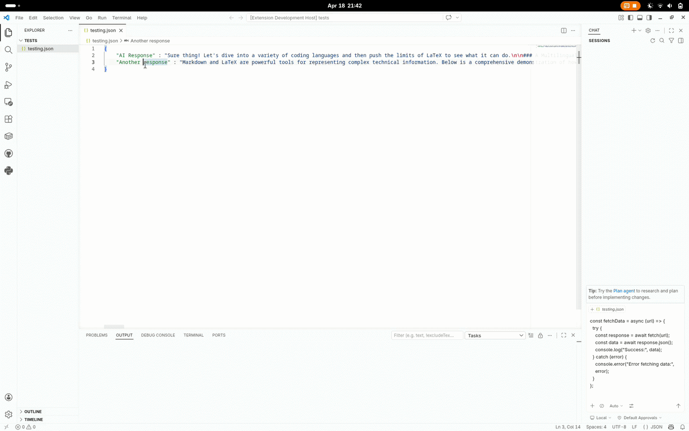

# Markson

Markdown in JSON—exactly what it sounds like.

Markdown in JSON is barely human readable. With Markson, simply click strings in JSON or other file types you specify. If selected strings are Markdown/LaTeX, a preview will open for you.

Works offline.

## Features

- Click a JSON string containing Markdown → opens a live preview
- Updates as you type
- Closes automatically when there’s nothing worth previewing 

>  Tip: You can define exactly which patterns trigger the preview in settings.

## Why use this?

Working with JSON often means dealing with:

- API responses
- AI / LLM input and output
- Escaped text blobs inside code

Instead of copy pasting or building temporary UI just to inspect content, Markson lets you read and iterate directly in your editor, on the exact string in the exact file, verbatim without hidden behavior.

## Extension Settings

This extension contributes the following settings:

* `Markson.enable`: Enable/disable this extension.
* `Markson.triggers`: Define which patterns activate the preview
* `Markson.suffixes`: File types the extension listens to

## Known Issues

None so far. If you find one, please open an issue.

## Release Notes

### 1.0.0

Initial release.

